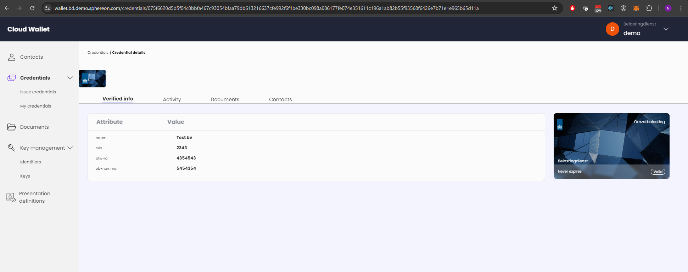
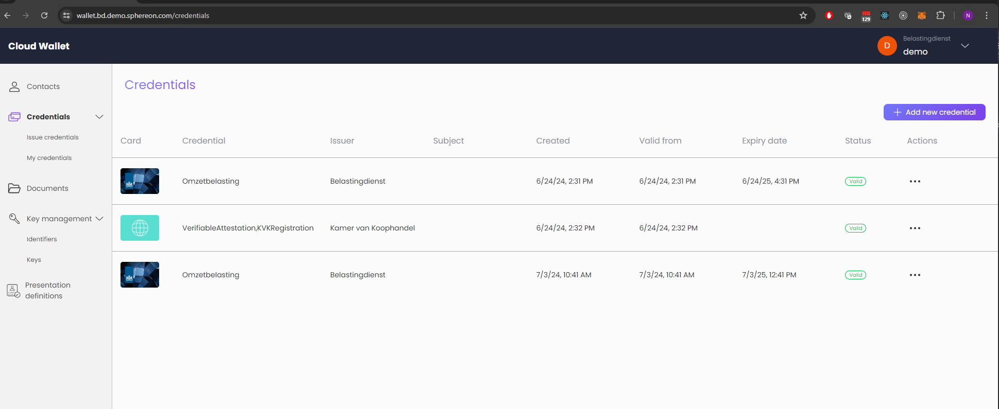

<!--suppress HtmlDeprecatedAttribute -->
<h1 align="center">
  <br>
  <br>SSI web-wallet and agent
  <br>
</h1>

# alpha state

Please be aware that although the wallet can be used to issue credential, manage presentation definitions, receive and
present credentials using the OID4VC set of specifications, the wallet is still in an alpha stage.

# Web wallet

This module is an open-source web wallet. It allows you to receive credentials using OID4VCI and present them using
OpenID4VP. The wallet can issue credentials using OID4VCI as well and can manage presentation definitions. In the near
future full support for managing the issuer and relying party components will be added. The wallet has support for
authorization code flows as well as pre-authorized flows. Support for using EBSI Legal Entity DIDs is also present.

As mentioned above, the wallet is still very much in an alpha stage and needs polishing in many areas. Please take that
into mind. For more info on the wallet itself see the [README](./packages/web-wallet/README.md) in the web-wallet module
directory.

<a href="docs/images/credential-details.png"></a>
<br/>
<a href="docs/images/credential-list.png"></a>
&nbsp;
<a href="docs/images/credential-issue.png"></a>
&nbsp;
<a href="docs/images/key-add.png"></a>

# Agent instances

The agent can be configured using several environment variables. Amongst these are variables to enable certain
functionalities of the agent.
The idea is that there are 2 agents with each a separate database:

- The Sphereon **Issuer Agent**: This agent running on port 5000 by default, contains the did:web of SPHEREON, and is
  responsible for issuance and optional
  storage of Verifiable Credentials. Creating DIDs from the REST API is disabled on this agent. Resolution of DIDs will
  use external resolution, meaning any did:web will be resolved to the actual https endpoint.
- TThe **Verifier Agent**: This agent running on port 5001 by default, it can verify Verifiable
  Credentials. It has no access to the database of the issuer. Creating Verifiable Credentials is disabled on this
  agent, but verifying them is enabled. The DIDs will be resolved in hybrid mode, meaning the agent will first look
  whether the DID is managed by the agent and then generate a DID resolution result from the database. If not managed by
  the agent it will perform an external resolution call.

# Agent documentation

The [agent documentation](./packages/agent/README.md) contains information about supported features, methods,
environment variables, as well as how to call the different REST API endpoints

# Building and testing

## Docker

Docker images are provided in the `docker` folder for both the issuer and customer agents

You can run `docker compose up` to run both agents in Docker. The issuer agent will run on port 5000 by default and the
customer agent will run on port 5001 by default.

## Postman collection

In the `docs/postman` folder you can find a Postman collection you can import in Postman. This collection allows you to
test REST API endpoints manually

## OpenAPI

The [OpenAPI definition](./docs/openapi/SPHEREON_VC_API.yaml) for all REST endpoints can be found in
the [docs/openapi](./docs/openapi) folder.
You can use the definition to generate models for a target language of choice.
This folder also contains an [HTML documentation](./docs/openapi/index.html) export of the REST API endpoints and
models.

## From source

### Lerna

These module make use of Lerna for managing multiple packages. Lerna is a tool that optimizes the workflow around
managing multi-package repositories with git and pnpm.

### Build

The below command builds all packages for you using lerna

### Pnpm

To build the project [pnpm](https://www.npmjs.com/package/pnpm) is used. Do not confuse this package manager with the
more regular `npm`.

Install pnpm globally:

```shell
npm -g install pnpm
```

Install the dependencies of all the projects

```shell
pnpm install
```

Build the projects

```shell
pnpm build
```

#### Production commands

If you want to run this project in production, directly from the project, instead of using an NPM repo for this project,
follow the below steps.

- Build the project according to the above steps first. This is needed because you will need to create the `dist`
  folders, and it needs the NodeJS and Typescript libraries during build.
- Remove the `node_modules` top-level folder, keep any `dist` folder, as that is where the built project is to be found.
  You can also run the command below (ignore the error about node_modules missing at the end)

```shell
pnpm run clean:modules
```

- Install modules without dev dependencies and also do it offline, since everything should already be available

```shell
pnpm run install:prod
# The above is the same as pnpm install --prod --offline
```

- Running the production installation

```shell
pnpm run start:prod
```

### Utility scripts

There are other utility scripts that help with development.

* `pnpm fix:prettier` - runs `prettier` to fix code style.

### Publish

Please note that currently the packages are marked as internal. Meaning they will not be published to an NPM repository!

There are scripts that can publish the following versions:

* `latest`
* `next`
* `unstable`

```shell
pnpm publish:[version]
```
