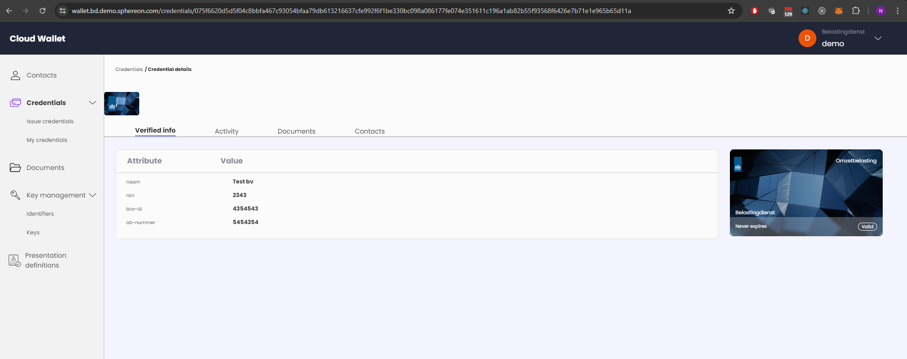
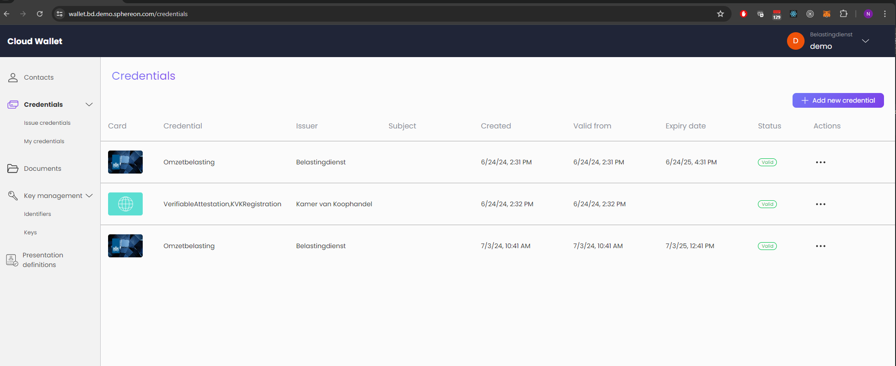
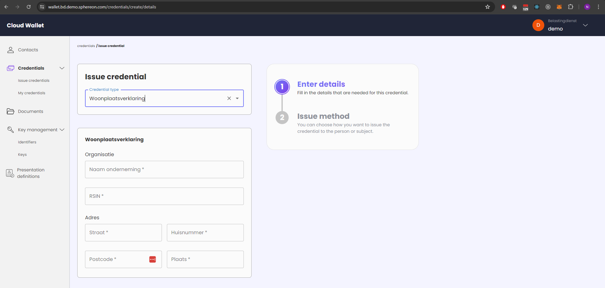
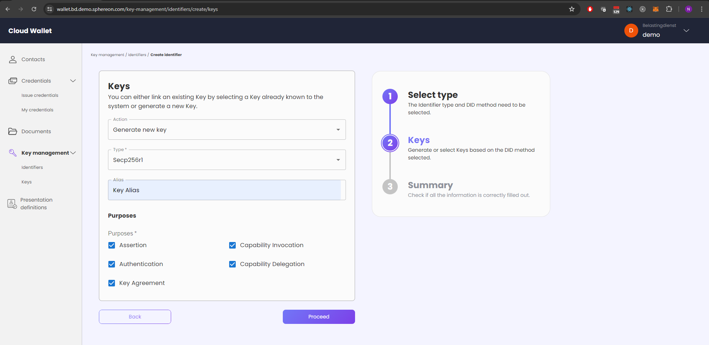

<!--suppress HtmlDeprecatedAttribute -->
<h1 align="center">
  <br>
  <a href="https://www.sphereon.com"></a>
  <br>Web Wallet
  <br>
</h1>

---

# alpha state

Please be aware that although the wallet can be used to issue credential, manage presentation definitions, receive and
present credentials using the OID4VC set of specifications, the wallet is still in an alpha stage.

# Web wallet

This module is an open-source web wallet. It allows you to receive credentials using OID4VCI and present them using
OpenID4VP. The wallet can issue credentials using OID4VCI as well and can manage presentation definitions. In the near
future full support for managing the issuer and relying party components will be added. The wallet has support for
authorization code flows as well as pre-authorized flows. Support for using EBSI Legal Entity DIDs is also present.

As mentioned above, the wallet is still very much in an alpha stage and needs polishing in many areas. Please take that
into mind.

<a href="../../docs/images/credential-details.png"></a>
<br/>
<a href="../../docs/images/credential-list.png"></a>&nbsp;
<a href="../../docs/images/credential-issue.png"></a>&nbsp;
<a href="../../docs/images/key-add.png"></a>

## pnpm

We use pnpm as package manager. Install it with the following command:

```shell
npm install --global pnpm
```

<b>NOTE</b>: After installation be sure to close the terminal window. If installed from your IDE, be sure to close the
IDE and start it (do not restart, as it might not pick up the latest environment variables)

Set the `NEXTAUTH_URL` environment variable in the `.env.local` file or use the shell. The value is the application url:

```shell
export NEXTAUTH_URL=<protocol://domain:port/path>
```

## Starting the Web-Wallet

First you should copy the `.env.example` file to `.env.local` and make the necessary changes.

The Web-Wallet can be started by running the following command.

Development mode

```shell
pnpm dev
```

Production mode

Create a production build

```shell
pnpm build
```

Start the server

```shell
pnpm start
```

## Local Development Setup for Web-Wallet with Supabase

The current wallet is using Supabase in certain areas. We are planning to remove that in the short term.
Supabase has two options to work with it locally. You can either use a CLI tool that they have provided or use a
dockerized
solution to do so.

- [Supabase CLI](https://supabase.com/docs/guides/cli/local-development)
- [Supabase self-hosting with docker](https://supabase.com/docs/guides/self-hosting/docker)

Following the guides above, you can connect and use your local supabase instance.

## License

Please note that the web wallet itself is licensed AGPL, meaning restrictions apply. Our low-level libraries, SDK and
mobile wallet are more liberal licensed using Apache2. We do offer alternative licenses if you want to perform make to
the code base without the requirement to re-publish as AGPL. Please contact us if this is the case.
